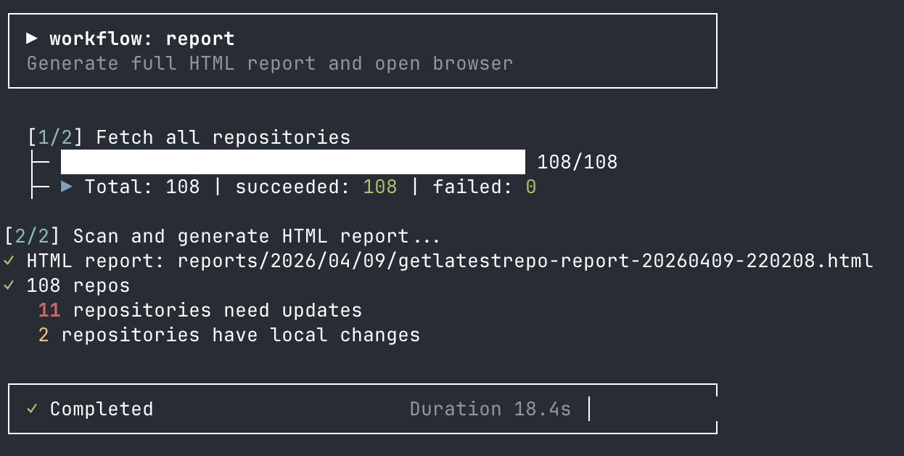

<div align="center">

# GetLatestRepo

[](https://www.rust-lang.org)
[](https://github.com/xcjy8/GetLatestRepo/actions)
[](LICENSE)

**A high-performance local Git repository batch manager written in Rust**

[简体中文](README.md)

</div>

---

## Why GetLatestRepo?

If you maintain dozens or even hundreds of Git repositories, these scenarios will sound familiar:

- Every morning you `cd` into each directory one by one, running `git fetch` and `git pull` — repetitive and time-consuming
- You're unsure which repos have uncommitted local changes, and a blind `pull` might cause conflicts
- You want a global repository status report, but can only compile it manually
- Your CI/CD pipeline needs to check if all repos are in sync with remote, but there's no ready-made tool

**GetLatestRepo was built to solve these problems.** One command to scan all repos, concurrent fetch, safe pull, and generate visual reports — turning repetitive work into automated workflows.

---

## Core Features

| Capability | Description |
|------|------|
| **Recursive Scan** | Discover all Git repos under a directory in seconds, with SQLite caching to avoid redundant scans |
| **Concurrent Fetch** | Tokio-based async concurrency, configurable parallelism and timeout, proxy support |
| **Safe Pull** | `pull-safe` auto-skips repos with local changes; `pull-force` auto-stashes changes |
| **Backup Sync** | `pull-backup` hard-resets to remote state, ideal for pure backup scenarios |
| **Security Scan** | Post-fetch, pre-pull remote-diff checks: sensitive files, suspicious code patterns, unknown committers |
| **Workflow Engine** | 7 built-in workflows chaining fetch → scan → pull → report into end-to-end flows |
| **Multi-format Reports** | Terminal table / HTML (dark theme) / Markdown, auto-archived by date |
| **Process Lock** | Prevents multiple instances from running concurrently to avoid data races |

---

## Screenshots

<p align="center">
  
</p>

<p align="center">
  
</p>

<p align="center">
  
</p>

---

## Installation

### Build from Source

```bash
git clone https://github.com/xcjy8/GetLatestRepo.git
cd GetLatestRepo
cargo build --release

# Optional: install to system path
sudo cp target/release/getlatestrepo /usr/local/bin/
```

### Prerequisites

- Rust 1.85+ (uses Rust Edition 2024)
- Git (installed on your system)

### Download from Releases

Head to [GitHub Releases](https://github.com/xcjy8/GetLatestRepo/releases) for pre-built binaries.

---

## Quick Start

```bash
# 1. Add a scan directory
getlatestrepo init ~/projects

# 2. Run the daily workflow (fetch + scan + status summary)
getlatestrepo workflow daily

# 3. Generate an HTML report and auto-open the browser
getlatestrepo workflow report
```

Three steps: add directory → run workflow → view report.

---

## Command Reference

### Global Flags

| Flag | Description |
|------|------|
| `--proxy` | Enable default proxy `http://127.0.0.1:7890` |
| `--proxy-url <URL>` | Specify a custom proxy address |
| `--no-security-check` | Disable pre-operation security scan |

### Command Overview

| Command | Description |
|------|------|
| `init <path>` | Add a scan directory |
| `scan` | Recursively discover all Git repos |
| `fetch` | Concurrently fetch all repos |
| `status <path>` | Show detailed status of a single repo |
| `config` | Manage scan sources, ignore rules, and settings |
| `workflow <name>` | Execute a workflow |
| `discard` | Interactively discard local changes |

### `init`

```bash
getlatestrepo init <PATH>
```

Adds a directory as a scan source. Subsequent scan/fetch operations will recursively discover all Git repos under it.

### `scan`

```bash
getlatestrepo scan [OPTIONS]
```

| Option | Description |
|------|------|
| `--fetch` | Run fetch before scanning |
| `-o, --output <FORMAT>` | Output format: `terminal` (default), `html`, `markdown` |
| `--out <PATH>` | Custom output file path |
| `-d, --depth <N>` | Limit scan depth |
| `-j, --jobs <N>` | Concurrency limit (default: 5) |

### `fetch`

```bash
getlatestrepo fetch [OPTIONS]
```

| Option | Description |
|------|------|
| `-j, --jobs <N>` | Concurrency limit (default: 5) |
| `-t, --timeout <SECS>` | Per-fetch timeout in seconds (default: 30) |

### `status`

```bash
getlatestrepo status <PATH> [OPTIONS]
```

| Option | Description |
|------|------|
| `--diff` | Show diff content |

### `config`

```bash
getlatestrepo config <SUBCOMMAND>
```

| Subcommand | Description |
|------|------|
| `add <PATH>` | Add a scan source |
| `list` | List all scan sources |
| `remove <PATH_OR_ID>` | Remove a scan source |
| `ignore <PATTERNS>` | Set global ignore rules (comma-separated) |
| `path` | Show config file location |

### `workflow`

```bash
getlatestrepo workflow [NAME] [OPTIONS]
```

| Option | Description |
|------|------|
| `--list` | List all available workflows |
| `--dry-run` | Show execution plan without running |
| `--silent` | Silent mode (exit code only) |
| `-j, --jobs <N>` | Override default concurrency |
| `-t, --timeout <SECS>` | Override default timeout |
| `--yes` | Auto-confirm prompts (`pull-safe` only) |
| `--diff-after` | Show new commits after pull (pull workflows only) |
| `--no-pull-guard` | Disable pull safety check (`pull-safe` only) |

### `discard`

```bash
getlatestrepo discard [PATH] [OPTIONS]
```

| Option | Description |
|------|------|
| `--yes` | Skip confirmation prompt |

---

## Workflow Engine

Workflows are the core design of GetLatestRepo. Each workflow chains multiple steps together, covering the full flow from fetch to reporting.

### Built-in Workflows

| Workflow | Steps | Description |
|--------|------|------|
| `daily` | fetch → scan | Daily patrol: fetch latest state, show summary in terminal |
| `check` | scan (scan only) | Quick view: no fetch, only show repos needing attention |
| `report` | fetch → scan (HTML) | Generate full HTML report, auto-open browser |
| `ci` | fetch → scan → check | CI check: return error code if any repo is behind |
| `pull-safe` | fetch → scan → pull | Safe pull: skip repos with local changes |
| `pull-force` | fetch → scan → stash → pull → pop | Force pull: auto-stash local changes |
| `pull-backup` | fetch → scan → hard reset | Backup sync: hard-reset to remote state |

### Usage Examples

```bash
# Daily patrol
getlatestrepo workflow daily

# CI pipeline integration (non-zero exit on failure)
getlatestrepo workflow ci --silent

# Safe batch pull (auto-skip dirty repos)
getlatestrepo workflow pull-safe --yes --diff-after

# Generate report (custom concurrency and timeout)
getlatestrepo workflow report --jobs 10 --timeout 60

# Preview execution plan (no actual run)
getlatestrepo workflow pull-force --dry-run
```

---

## Security Scan Mechanism

GetLatestRepo fetches remote objects first without merging them into the working tree, then compares local `HEAD` with the upstream tracking ref before pull/reset:

### Detection Categories

| Category | What It Detects |
|------|----------|
| **Sensitive File Changes** | `.env`, key files (`.pem`, `id_rsa`), CI configs (`.github/workflows`, `Jenkinsfile`), container credentials (`.docker/config.json`, `kubeconfig`) |
| **Suspicious Code Patterns** | `eval()`/`exec()` calls, base64 decoding, onion addresses, `curl \| sh`, `wget` downloads, etc. |
| **Unknown Committers** | New committers not in the known contributors list |

### Risk Levels

| Level | Action |
|------|----------|
| Safe | Proceed normally |
| Medium | Prompt for confirmation |
| High | Block operation |

Pre-pull security scanning can be disabled via the `--no-security-check` global flag.

---

## Configuration

Config file is located at `~/.config/getlatestrepo/config.toml` (viewable via `getlatestrepo config path`).

### Default Configuration

```toml
default_jobs = 5        # Default concurrency
default_timeout = 30    # Default timeout (seconds)
default_depth = 5       # Default scan depth

# Ignore rules
ignore_patterns = [
    ".git",
    "node_modules",
    "target",
    "vendor",
    ".idea",
    ".vscode",
]

# Sync settings
[sync]
auto_sync = true        # Auto-scan newly added repos
strict_sync = false     # Strict mode: full scan when count mismatch
```

### Environment Variables

| Variable | Description |
|------|------|
| `GETLATESTREPO_CONFIG_DIR` | Override config directory path |
| `HTTP_PROXY` / `HTTPS_PROXY` | System proxy (or use `--proxy` flag) |

---

## Report System

Generated reports are auto-archived to:

```
reports/YYYY/MM/DD/getlatestrepo-report-YYYYMMDD-HHMMSS.<ext>
```

- `reports/latest.html` symlink always points to the newest HTML report
- Supports terminal table, HTML (dark theme), and Markdown formats
- HTML reports can auto-open in browser

---

## Tech Stack

| Component | Choice |
|------|----------|
| CLI Framework | clap 4.5 |
| Git Operations | libgit2 (git2 crate) |
| Async Runtime | Tokio |
| Database | SQLite (rusqlite + WAL mode) |
| Terminal Output | comfy-table + colored + indicatif (progress bars) |
| HTML Templates | Askama |
| Config Format | TOML + JSON |

### Build Optimization

Release builds enable LTO, single codegen unit, and symbol stripping for minimal binary size and maximum runtime performance.

---

## FAQ

### Q: Scan is slow?

Use the `-d` flag to limit scan depth, or adjust `default_depth` in `config.toml`. For large directory trees, reducing depth significantly improves speed.

### Q: How to exclude specific directories?

Set ignore rules via `getlatestrepo config ignore <patterns>`, supporting comma-separated patterns. The command updates existing scan sources and future scan sources. By default, `node_modules`, `target`, `vendor` and other common directories are already ignored.

### Q: What's the difference between `pull-safe` and `pull-force`?

- `pull-safe`: Only pulls clean repos (no local changes). Repos with changes are skipped.
- `pull-force`: Auto-stashes local changes → pull → stash pop. Good for batch sync but may cause conflicts.
- `pull-backup`: For pure backup mirrors. After fetch, it hard-resets to the remote tracking branch and tries to recover from an existing unmerged index, empty-stash state, or long symlink checkout failure with explicit diagnostics.

### Q: How to use in CI?

```bash
getlatestrepo workflow ci --silent
if [ $? -ne 0 ]; then
    echo "Some repos are behind remote"
    exit 1
fi
```

### Q: Proxy not working?

Priority: `--proxy-url` > `--proxy` > system env vars `HTTP_PROXY`/`HTTPS_PROXY`. Ensure the proxy address is correct and accessible.

---

## Contributing

Issues and Pull Requests are welcome!

1. Fork this repo
2. Create a feature branch: `git checkout -b feature/your-feature`
3. Commit your changes: `git commit -m "feat: add your feature"`
4. Push the branch: `git push origin feature/your-feature`
5. Create a Pull Request

### Development Setup

```bash
git clone https://github.com/xcjy8/GetLatestRepo.git
cd GetLatestRepo
cargo build
cargo test
```

---

## Changelog

| Version | Highlights |
|------|----------|
| v0.1.9 | Dependency security upgrades, auto-sync fix, and release quality hardening |
| v0.1.8 | pull-backup workflow and bilingual README rewrite |
| v0.1.7 | Full bug fix and security hardening |
| v0.1.6 | Rust Edition 2024, dead code cleanup, pre-scan security batch |
| v0.1.5 | Removed git2 network fetch path, data-verification-based optimization |
| v0.1.4 | Fetch dual-layer architecture, progress bar refinement, git2 preference cache |
| v0.1.3 | Three-layer graceful shutdown + startup self-check + residual cleanup |
| v0.1.2 | 14 bug fixes (security/concurrency/Git state/signals/blocking IO) |
| v0.1.1 | P0/P1/P2 full fix and security refactor |
| v0.1.0 | Initial release |

Full changelog at [GitHub Releases](https://github.com/xcjy8/GetLatestRepo/releases).

---

## License

This project is dual-licensed:

- **AGPL-3.0-or-later** — For open-source and non-commercial use. See [LICENSE](LICENSE).
- **Commercial License** — For closed-source or commercial use, please contact the author.

To use this software in a commercial product without disclosing source code, a separate commercial license must be obtained from the copyright holder.

---

## Author

**xcjy8** — [GitHub](https://github.com/xcjy8)

Project: [https://github.com/xcjy8/GetLatestRepo](https://github.com/xcjy8/GetLatestRepo)
